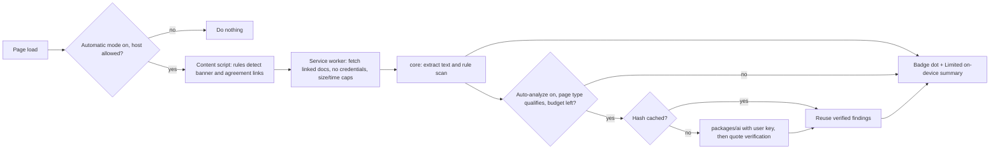

```mermaid
flowchart LR
  A[Page load] --> B{Automatic mode on, host allowed?}
  B -- no --> Z[Do nothing]
  B -- yes --> C[Content script: rules detect banner and agreement links]
  C --> D[Service worker: fetch linked docs, no credentials, size/time caps]
  D --> E[core: extract text and rule scan]
  E --> F[Badge dot + Limited on-device summary]
  E --> G{Auto-analyze on, page type qualifies, budget left?}
  G -- no --> F
  G -- yes --> H{Hash cached?}
  H -- yes --> I[Reuse verified findings]
  H -- no --> J[packages/ai with user key, then quote verification]
  J --> I
  I --> F
```